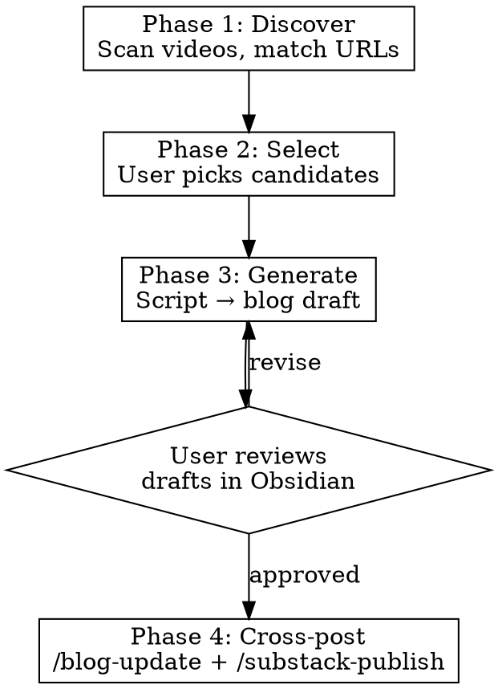

# Video-to-Blog Pipeline

Discover published videos without blog posts, batch-generate blog drafts from video scripts, and optionally cross-post to Substack. Single command replaces the manual `/repurpose` → `/blog-post` → `/substack-publish` chain.

## Before Starting, Ask Yourself

- Do any selected videos lack scripts in `Related/`? Flag them — briefs alone produce thinner drafts.
- Is the video's topic already covered by an existing blog post under a different title? URL matching catches exact matches. For topical overlap, compare the candidate's H1 sections against existing blog post titles and `categories:` — if 2+ categories match and titles share key nouns, flag it for manual review.
- Does the video script contain sponsored segments that should be stripped or adapted for blog format?
- Will the blog title differ from the video title? Video titles optimize for CTR; blog titles optimize for SEO.

## NEVER Do

- **NEVER copy-paste script text verbatim** — spoken language ("Watch this", "Let me show you", "as you can see", "I use this") reads poorly in written form. Every sentence must be rewritten for reading, not watching.
- **NEVER use first-person "I" or "we" voice** — blog posts use second-person "you" throughout. The script's "I use this shortcut daily" becomes "This shortcut saves time daily." The script's "Let me show you" becomes a direct instruction. Load `voice-and-tone.md` and follow it — the blog voice section is explicit about this.
- **NEVER include production artifacts in blog output** — `>[!info] Signation`, `#### [B-Roll: ...]`, `### Voice over`, camera directions, roll markers. These are filming instructions, not content.
- **NEVER generate a blog post without reading the actual script file** — the video brief alone lacks the content depth needed for a quality blog draft. If no script exists, warn the user and generate a stub outline only.
- **NEVER auto-publish or set `draft: false`** — all generated posts start as `draft: true`. Publishing requires explicit user approval through `/blog-update`.
- **NEVER skip the "In a Nutshell" section** — every blog post starts with this section containing a `[!important|float-r]` callout linking back to the YouTube video and key resources.
- **NEVER use `categories: blog`** — `blog` is a tag, not a category. Categories are topic-based (e.g., `obsidian`, `productivity`, `excel`).
- **NEVER invent content not in the script** — the blog post adapts what exists. Adding new tips, steps, or advice that weren't in the video misrepresents the source content.

## Workflow



### Phase 1 — Discover

1. Read all `*.md` files in `$VAULT_PATH/01 Projects/LP Videos/` (not subdirectories)
2. Filter to video briefs where frontmatter `phase` contains `Published` (case-insensitive — match "Published", "published", "PUBLISHED"). Skip briefs missing the `phase` field entirely.
3. Extract `url:` (YouTube URL) from each brief. Skip briefs with no `url:` field — warn: "Skipped [Title]: no YouTube URL in frontmatter"
4. Read all `*.md` files in `$VAULT_PATH/09 Blog/` and extract `source:` frontmatter values
5. A video is **covered** if its `url` matches any blog post's `source:` (exact string match)
6. For uncovered videos, check if `LP Videos/Related/[Title] - Script.md` exists

Present results:

```
# Videos without blog posts (N found)

| # | Date | Title | Script |
|---|------|-------|--------|
| 1 | 2026-01-17 | Obsidian Bases Made Simple | yes |
| 2 | 2025-11-15 | Journaling Hack | yes |
| 3 | 2025-10-20 | ResearchFlow | no |
```

### Phase 2 — Select

Prompt: "Which videos to process? Enter numbers (1, 3, 5), range (1-5), or 'all'."

Confirm selection before proceeding. Videos without scripts get a warning — offer to skip or generate stub outlines.

**Edge cases:**
- Video brief has no `url:` field → skip it, warn user ("cannot match without YouTube URL")
- Script uses non-standard section headers (no `# 1.` numbering) → adapt, use whatever H1/H2 structure the script has
- Multiple videos share the same YouTube URL → deduplicate, process once
- Blog post already exists as draft (`draft: true`) with matching `source:` → skip, it's already in the pipeline

### Phase 3 — Generate

For each selected video:

**Load references (MANDATORY on first generation):**
- `~/.claude/references/voice-and-tone.md` — brand voice
- `~/.claude/skills/blog-post/references/post_structure.md` — blog structure conventions
- `~/.claude/skills/blog-post/assets/frontmatter_template.md` — frontmatter template

**Do NOT load:** `lean-master-spec.md`, `Metadata_Standards.md`, `vault-scanning-conventions.md` — these are vault operations references, not relevant to blog generation.

**Read source files:**
- Video brief: `LP Videos/[Title].md` → `url`, `publishDate`, `tags`, `sponsored`, `sponsor`
- Script: `LP Videos/Related/[Title] - Script.md` → all content

**Transform:**

| Script element | Blog element |
|---------------|-------------|
| `# Intro` / `## A-Roll` opening | Opening paragraph after "In a Nutshell" |
| `# N. SECTION TITLE` | `# Section Title` (H1) |
| `### Voice over` text | Prose paragraphs (rewritten for reading) |
| `#### [Visual: show X]` | `> [!image\|float-r]` placeholder or omit |
| Inline code / shortcuts | **Bold** or `inline code` as appropriate |
| `# Goodbye` / `# Ending` | Omit — blog posts don't need sign-offs |
| Sponsored segments | Omit or adapt as disclosure note |
| "I use this...", "Let me show you" | Rewrite in "you" voice — "This saves time...", direct instruction |

**Worked example — before/after:**

Script (voice-over with production cues):
```
# 1. CTRL + ALT + V - paste special
### Voice over
#### Copy data from a date column with a specific format to another date column
**`Ctrl + Alt + V`** opens the `Paste Special` dialog box. It lets you paste
specific parts of copied data. This is particularly helpful if the target
format differs from your source format and you want to paste only the values.
```

Blog (rewritten for reading, "you" voice, no artifacts):
```markdown
# Paste Special: Copy Format, Keep Values

**`Ctrl + Alt + V`** opens the Paste Special dialog, giving you control over
exactly what gets pasted — values, formulas, formats, or comments. When copying
between columns with different date formats, paste only the values and let the
target format apply automatically. One shortcut, several steps saved.
```

Notice: numbered title → descriptive H1, voice-over/visual cues stripped, "you" voice, benefit-driven closing line.

**Write frontmatter:**
```yaml
---
title: [SEO-optimized title — may differ from video]
aliases:
author:
  - Sascha D. Kasper
source: [YouTube URL from video brief]
description: [~150 char SEO description]
cover:
date: [video publishDate, YYYY-MM-DD]
draft: true
categories:
  - [primary topic]
  - [subtopic]
cssclasses:
tags:
  - blog
created: [current ISO timestamp]
updated: [current ISO timestamp]
---
```

**Write "In a Nutshell" section:**
```markdown
# In a Nutshell
> [!important|float-r] Useful / Download
> * Tutorial: [YouTube](https://youtu.be/VIDEO_ID)
> * Download: [FREE Lean Starter Vault](https://kpr.me/lsv)
> * [More Obsidian Video Tutorials](playlist-url)
> * [Discord](https://discord.gg/sbMg6PP2vq)

[2-3 sentence summary of the post's core value]
```

Adapt the callout links based on video topic — not all videos reference the Lean Starter Vault or Obsidian playlist. Only include relevant links.

**Save** to `$VAULT_PATH/09 Blog/[Blog Title].md`

**After all drafts**, present summary:
```
# Generated N blog drafts

| # | Title | Words | Source | File |
|---|-------|-------|--------|------|
| 1 | ... | ~1200 | youtu.be/... | 09 Blog/... |

All saved as draft: true. Review in Obsidian, then run /blog-update to publish.
```

### Phase 4 — Cross-post (Optional)

After user reviews drafts, offer `/blog-update` then `/substack-publish --draft`. Both require explicit approval.

## Verification Checklist

After generating drafts, spot-check:
- [ ] Frontmatter has all required fields (`title`, `author`, `source`, `description`, `date`, `draft: true`, `categories`, `tags`)
- [ ] `source:` contains the correct YouTube URL
- [ ] `categories:` does not contain `blog` (that's a tag)
- [ ] "In a Nutshell" section exists with `[!important|float-r]` callout
- [ ] No production artifacts remain (Signation, B-Roll cues, Voice over headers, camera directions)
- [ ] Content uses "you" voice, no first-person "I" or "we"
- [ ] Content is written for reading, not spoken delivery
- [ ] H1/H2 heading hierarchy is clean (no H3+ unless truly needed)
- [ ] Re-running discovery no longer shows processed videos as candidates

## Cross-References

- `/blog-post` — blog writing conventions and structure
- `/repurpose` — Gift extraction methodology (YTGS Gift System)
- `/blog-update` — Quartz publishing workflow
- `/substack-publish` — Substack cross-posting
- `/ai-seo` — SEO audit for generated posts
